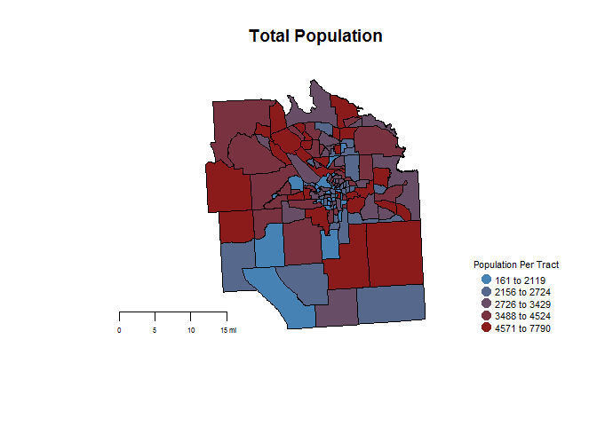

Lab3 Mengran
================

``` r
library(maptools)
```

    ## Warning: package 'maptools' was built under R version 3.3.2

    ## Loading required package: sp

    ## Warning: package 'sp' was built under R version 3.3.2

    ## Checking rgeos availability: FALSE
    ##      Note: when rgeos is not available, polygon geometry     computations in maptools depend on gpclib,
    ##      which has a restricted licence. It is disabled by default;
    ##      to enable gpclib, type gpclibPermit()

``` r
library(sp)
library(dplyr)
```

    ## 
    ## Attaching package: 'dplyr'

    ## The following objects are masked from 'package:stats':
    ## 
    ##     filter, lag

    ## The following objects are masked from 'package:base':
    ## 
    ##     intersect, setdiff, setequal, union

``` r
library(maps)
```

    ## Warning: package 'maps' was built under R version 3.3.2

``` r
dir.create( "shapefiles" )
```

    ## Warning in dir.create("shapefiles"): 'shapefiles' already exists

``` r
setwd( "./shapefiles" )

download.file("ftp://ftp2.census.gov/geo/tiger/TIGER2010/TRACT/2010/tl_2010_36067_tract10.zip", "onondaga census tracts.zip" )

unzip( "onondaga census tracts.zip" )

file.remove( "onondaga census tracts.zip" )
```

    ## [1] TRUE

``` r
dir()
```

    ## [1] "tl_2010_36067_tract10.dbf"     "tl_2010_36067_tract10.prj"    
    ## [3] "tl_2010_36067_tract10.shp"     "tl_2010_36067_tract10.shp.xml"
    ## [5] "tl_2010_36067_tract10.shx"

``` r
#tutorial https://www.youtube.com/watch?v=EZvdOjx47Kw&list=PLCuEIQl2BByhnFWu858xy5O0rfVAI94Hw   not the same process though

syr <- readShapePoly( fn="tl_2010_36067_tract10", proj4string=CRS("+proj=longlat +datum=WGS84") )

plot( syr, border="gray10")
```


    ## Skipping install of 'censusapi' from a github remote, the SHA1 (c0b335cd) has not changed since last install.
    ##   Use `force = TRUE` to force installation

    ## 
    ## Attaching package: 'censusapi'

    ## The following object is masked from 'package:methods':
    ## 
    ##     getFunction

``` r
##Create choropleth maps that include a title and legend for each variable

#rename variables
acs5_2015 <- plyr::rename(acs5_2015, c("B01002A_001E"="MedianAge", "B01001_001E"="TotalPolulation", "B17010_017E"="SingleMomPoverty"))
```

``` r
#Mutate data
acs5_2015 <- mutate(acs5_2015, SingleMomPoverty = SingleMomPoverty/TotalPolulation)


#assign a color to age group, red = high, blue = low, this plot is about median age data

color.function <- colorRampPalette( c("firebrick4","steel blue" ) )

col.ramp <- color.function( 5 ) # number of groups you desire

color.vector <- cut( rank(acs5_2015$MedianAge), breaks=5, labels=col.ramp )

color.vector <- as.character( color.vector )

this.order <- match( syr$TRACTCE10, acs5_2015$tract )

color.vec.ordered <- color.vector[ this.order ]


plot(syr, col=color.vec.ordered, main="Median Age in Onondaga County")
map.scale( metric=F, ratio=F, relwidth = 0.15, cex=0.5 )

min.x <- tapply( acs5_2015$MedianAge, color.vector, min )
max.x <- tapply( acs5_2015$MedianAge, color.vector, max )

legend.text <- paste( min.x, max.x, sep=" to ")


legend( "bottomright", bg="white",
        pch=19, pt.cex=0.8, cex=0.6,
        legend=legend.text, 
        col=col.ramp, 
        box.col="white",
        title="Median Age" 
)
```


``` r
# create a plot about single mom in poverty rate


color.function <- colorRampPalette( c("steel blue", "firebrick4") )

col.ramp <- color.function( 5 ) # number of groups you desire

color.vector <- cut( rank(acs5_2015$SingleMomPoverty), breaks=5, labels=col.ramp )

color.vector <- as.character( color.vector )

this.order <- match( syr$TRACTCE10, acs5_2015$tract )

color.vec.ordered <- color.vector[ this.order ]

min.x <- tapply( acs5_2015$SingleMomPoverty, color.vector, min )
max.x <- tapply( acs5_2015$SingleMomPoverty, color.vector, max )

legend.text <- paste( min.x, max.x, sep=" to ")

plot(syr, col=color.vec.ordered, main="Rate of Single Mother in Poverty")
map.scale( metric=F, ratio=F, relwidth = 0.15, cex=0.5)

legend( "bottomright", bg="white",
        pch=19, pt.cex=0.8, cex=0.4,
        legend=legend.text, 
        col=col.ramp, 
        box.col="white",
        title="Rate of Single Mother in Poverty" 
)
```


``` r
#create a plot about rate of population receive SNAP in onondaga county
color.function <- colorRampPalette( c("steel blue", "firebrick4") )

col.ramp <- color.function( 5 ) # number of groups you desire

color.vector <- cut( rank(acs5_2015$TotalPolulation), breaks=5, labels=col.ramp )

color.vector <- as.character( color.vector )

this.order <- match( syr$TRACTCE10, acs5_2015$tract )

color.vec.ordered <- color.vector[ this.order ]


plot(syr, col=color.vec.ordered, main="Total Population")
map.scale( metric=F, ratio=F, relwidth = 0.15, cex=0.5 )


min.x <- tapply( acs5_2015$TotalPolulation, color.vector, min )
max.x <- tapply( acs5_2015$TotalPolulation, color.vector, max )

legend.text <- paste( min.x, max.x, sep=" to ")


legend( "bottomright", bg="white",
        pch=19, pt.cex=1.5, cex=0.7,
        legend=legend.text, 
        col=col.ramp, 
        box.col="white",
        title="Population Per Tract" 
)
```


