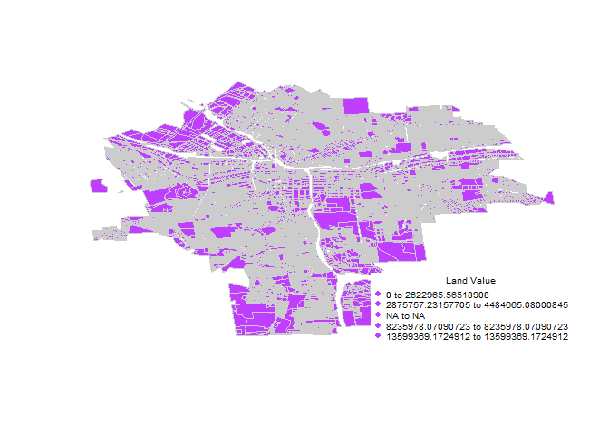
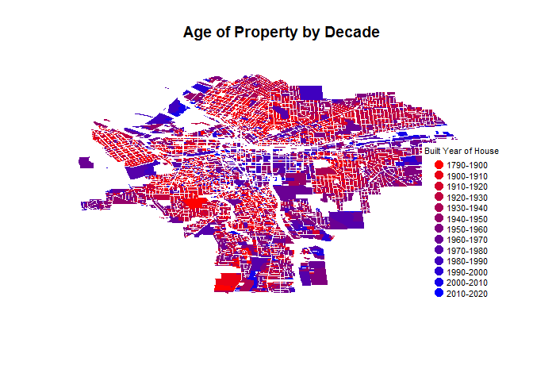

lab04\_mengran
================

``` r
# Question 1: How many single family homes are in each neighborhood?
# Create a table of the count of single family homes by neighborhood
# Highlight all single family homes, using a different color for each neighborhood


list.by.neighborhood <- table( syr.dat$Nhood[syr.dat$LandUse == "Single Family"])

list.by.neighborhood
```

    ## 
    ##                Brighton          Court-Woodlawn                Downtown 
    ##                    1398                    1859                       1 
    ##                Eastwood                 Elmwood            Far Westside 
    ##                    3605                     909                     471 
    ##         Franklin Square            Hawley-Green               Lakefront 
    ##                       0                      52                      24 
    ##            Lincoln Hill             Meadowbrook           Near Eastside 
    ##                     580                    1721                      93 
    ##           Near Westside            North Valley               Northside 
    ##                     521                    1194                    1508 
    ##          Outer Comstock               Park Ave.           Prospect Hill 
    ##                     697                     167                      29 
    ##            Salt Springs                Sedgwick              Skunk City 
    ##                    1029                     892                     345 
    ##            South Campus            South Valley               Southside 
    ##                      25                    1605                     481 
    ##               Southwest              Strathmore               Tipp Hill 
    ##                     419                    1475                     785 
    ##         University Hill University Neighborhood       Washington Square 
    ##                      17                     803                     425 
    ##                Westcott               Winkworth 
    ##                     851                     411

``` r
col.Nhood <- c(  "darkorchid1", "mediumorchid2", "magenta3", "darkmagenta",
                "yellow1", "lightgoldenrod1", "lightpink", "hotpink", "deeppink", "violetred3", "indianred", "firebrick",
                "darkslategray2", "lightblue3", "dodgerblue", "royalblue2", "deepskyblue4", 
                "lightsalmon1", "darkorange", "chocolate1", "orange3", "orangered2",
                "mediumpurple1","gold", "goldenrod", "darkgoldenrod1",
                "chartreuse2", "darkolivegreen3", "darkseagreen3", "green4", "seagreen4",
                "gray40", "gray" )

palette(col.Nhood)

Nhood.Color <- factor(syr.dat$Nhood)
Nhood.Color[syr.dat$LandUse != "Single Family"] <- NA


graphics.off() 
par("mar") 
```

    ## [1] 5.1 4.1 4.1 2.1

``` r
par(mar=c(1,1,1,1))

plot(syr.parcel, border="grey95", col=Nhood.Color, main="Single Family Homes By Neighborhood")

legend("bottomright", bg="white", pch=19, pt.cex=0.8, cex=0.4, legend=levels(syr.parcel$Nhood), col=col.Nhood)
```

``` r
# Question 2: Where does land in Syracuse have the highest value? 
# Create a table of the count of single family homes with values above $200k in each neighborhood, as a pecentage of all single family homes
# Plot the value / acre of all parcels in Syracuse


#table of count of single family homes above $200k in each neighborhood

highvalue.single <- table( syr.dat$Nhood[syr.dat$LandUse == "Single Family" &   
                           syr.dat$AssessedVa > 200000]
                         ) 

highvalue.single
```

    ## 
    ##                Brighton          Court-Woodlawn                Downtown 
    ##                       0                       0                       0 
    ##                Eastwood                 Elmwood            Far Westside 
    ##                       1                       0                       0 
    ##         Franklin Square            Hawley-Green               Lakefront 
    ##                       0                       0                       0 
    ##            Lincoln Hill             Meadowbrook           Near Eastside 
    ##                       7                      60                       0 
    ##           Near Westside            North Valley               Northside 
    ##                       0                       0                       2 
    ##          Outer Comstock               Park Ave.           Prospect Hill 
    ##                       3                       0                       0 
    ##            Salt Springs                Sedgwick              Skunk City 
    ##                       0                     130                       0 
    ##            South Campus            South Valley               Southside 
    ##                       0                       5                       0 
    ##               Southwest              Strathmore               Tipp Hill 
    ##                       0                      16                       0 
    ##         University Hill University Neighborhood       Washington Square 
    ##                       1                      17                       0 
    ##                Westcott               Winkworth 
    ##                       0                      11

``` r
#percentage of expensive single family housing

tbl.expensive <- highvalue.single

percentage.table <- cbind(tbl.expensive,prop.table(tbl.expensive))


#plot value/acre of all parcels in Syracuse

value.acre <- mutate(.data = syr.dat, value.per.acre = AssessedLa / Acres)

value.acre2 <- value.acre[na.omit(value.acre$value.per.acre), ]
col.divide <- cut( value.acre$value.per.acre, breaks = 5 )

plot( syr.parcel, border="gray80", col=col.divide, oma=c(5,7,1,1) )


min.x <- tapply( value.acre$value.per.acre, col.divide, min )
max.x <- tapply( value.acre$value.per.acre, col.divide, max )

legend.text <- paste( min.x, max.x, sep=" to ")


legend( "bottomright", bg="white",
        pch=19, pt.cex=0.8, cex=0.6,
        legend=legend.text, 
        col=col.divide, 
        box.col="white",
        title="Land Value" 
)
```



``` r
##Problem!! still have NAs in legend category and the color difference didn't show up in plot and it is only purple
```

``` r
# Question 3: What is the age of single family homes in each neighborhood? 
# Create a table that reports the 10th, 25th, 50th, 75th, and 90th percentile of home ages in each neighborhood.
#Create a choropleth map that shows the age of properties by decade, pre-1900s can be one category.


Nhood.YearBuilt <- select(syr.dat, Nhood, LandUse, YearBuilt)
Yearbuilt.single <- filter(Nhood.YearBuilt, LandUse == "Single Family" )

Yearbuilt.single$YearBuilt <- as.numeric(as.character((Yearbuilt.single$YearBuilt)))

Yearbuilt.age <- mutate(Yearbuilt.single, Age = 2017 - YearBuilt)

Yearbuilt.age <- select(Yearbuilt.age, Nhood, Age)

age.nbhd <- group_by(Yearbuilt.age, Nhood)

PercentileTable <- summarise(age.nbhd, Tenth = quantile(Age, probs=0.10, na.rm=T), TwentyFifth = quantile(Age, probs=0.25, na.rm=T), Fiftieth = quantile(Age, probs=0.50, na.rm=T), SeventyFifth = quantile(Age, probs=0.75, na.rm=T), Ninetieth = quantile(Age, probs=0.90, na.rm=T))
pander(PercentileTable)
```

<table>
<colgroup>
<col width="28%" />
<col width="9%" />
<col width="16%" />
<col width="13%" />
<col width="18%" />
<col width="13%" />
</colgroup>
<thead>
<tr class="header">
<th align="center">Nhood</th>
<th align="center">Tenth</th>
<th align="center">TwentyFifth</th>
<th align="center">Fiftieth</th>
<th align="center">SeventyFifth</th>
<th align="center">Ninetieth</th>
</tr>
</thead>
<tbody>
<tr class="odd">
<td align="center">Brighton</td>
<td align="center">62.0</td>
<td align="center">87.00</td>
<td align="center">97</td>
<td align="center">107</td>
<td align="center">117.0</td>
</tr>
<tr class="even">
<td align="center">Court-Woodlawn</td>
<td align="center">64.0</td>
<td align="center">74.00</td>
<td align="center">88</td>
<td align="center">97</td>
<td align="center">117.0</td>
</tr>
<tr class="odd">
<td align="center">Downtown</td>
<td align="center">89.0</td>
<td align="center">89.00</td>
<td align="center">89</td>
<td align="center">89</td>
<td align="center">89.0</td>
</tr>
<tr class="even">
<td align="center">Eastwood</td>
<td align="center">62.0</td>
<td align="center">74.00</td>
<td align="center">87</td>
<td align="center">97</td>
<td align="center">102.0</td>
</tr>
<tr class="odd">
<td align="center">Elmwood</td>
<td align="center">61.3</td>
<td align="center">82.00</td>
<td align="center">89</td>
<td align="center">97</td>
<td align="center">117.0</td>
</tr>
<tr class="even">
<td align="center">Far Westside</td>
<td align="center">87.0</td>
<td align="center">97.00</td>
<td align="center">107</td>
<td align="center">117</td>
<td align="center">127.0</td>
</tr>
<tr class="odd">
<td align="center">Hawley-Green</td>
<td align="center">88.0</td>
<td align="center">107.00</td>
<td align="center">117</td>
<td align="center">127</td>
<td align="center">146.1</td>
</tr>
<tr class="even">
<td align="center">Lakefront</td>
<td align="center">88.6</td>
<td align="center">97.00</td>
<td align="center">112</td>
<td align="center">127</td>
<td align="center">137.0</td>
</tr>
<tr class="odd">
<td align="center">Lincoln Hill</td>
<td align="center">32.0</td>
<td align="center">87.00</td>
<td align="center">97</td>
<td align="center">117</td>
<td align="center">127.0</td>
</tr>
<tr class="even">
<td align="center">Meadowbrook</td>
<td align="center">57.0</td>
<td align="center">62.00</td>
<td align="center">67</td>
<td align="center">85</td>
<td align="center">91.0</td>
</tr>
<tr class="odd">
<td align="center">Near Eastside</td>
<td align="center">74.1</td>
<td align="center">82.00</td>
<td align="center">97</td>
<td align="center">112</td>
<td align="center">127.0</td>
</tr>
<tr class="even">
<td align="center">Near Westside</td>
<td align="center">16.5</td>
<td align="center">28.00</td>
<td align="center">97</td>
<td align="center">117</td>
<td align="center">136.4</td>
</tr>
<tr class="odd">
<td align="center">North Valley</td>
<td align="center">57.0</td>
<td align="center">62.00</td>
<td align="center">82</td>
<td align="center">92</td>
<td align="center">105.0</td>
</tr>
<tr class="even">
<td align="center">Northside</td>
<td align="center">87.0</td>
<td align="center">97.00</td>
<td align="center">107</td>
<td align="center">117</td>
<td align="center">127.0</td>
</tr>
<tr class="odd">
<td align="center">Outer Comstock</td>
<td align="center">52.0</td>
<td align="center">58.00</td>
<td align="center">67</td>
<td align="center">76</td>
<td align="center">92.0</td>
</tr>
<tr class="even">
<td align="center">Park Ave.</td>
<td align="center">87.0</td>
<td align="center">97.00</td>
<td align="center">107</td>
<td align="center">117</td>
<td align="center">127.0</td>
</tr>
<tr class="odd">
<td align="center">Prospect Hill</td>
<td align="center">75.0</td>
<td align="center">87.00</td>
<td align="center">97</td>
<td align="center">117</td>
<td align="center">130.0</td>
</tr>
<tr class="even">
<td align="center">Salt Springs</td>
<td align="center">55.0</td>
<td align="center">62.00</td>
<td align="center">77</td>
<td align="center">89</td>
<td align="center">97.0</td>
</tr>
<tr class="odd">
<td align="center">Sedgwick</td>
<td align="center">64.0</td>
<td align="center">73.75</td>
<td align="center">87</td>
<td align="center">95</td>
<td align="center">107.0</td>
</tr>
<tr class="even">
<td align="center">Skunk City</td>
<td align="center">55.7</td>
<td align="center">87.00</td>
<td align="center">97</td>
<td align="center">117</td>
<td align="center">127.0</td>
</tr>
<tr class="odd">
<td align="center">South Campus</td>
<td align="center">30.8</td>
<td align="center">52.00</td>
<td align="center">60</td>
<td align="center">71</td>
<td align="center">89.0</td>
</tr>
<tr class="even">
<td align="center">South Valley</td>
<td align="center">54.0</td>
<td align="center">62.00</td>
<td align="center">67</td>
<td align="center">87</td>
<td align="center">97.0</td>
</tr>
<tr class="odd">
<td align="center">Southside</td>
<td align="center">24.0</td>
<td align="center">87.00</td>
<td align="center">97</td>
<td align="center">116</td>
<td align="center">117.0</td>
</tr>
<tr class="even">
<td align="center">Southwest</td>
<td align="center">16.5</td>
<td align="center">24.00</td>
<td align="center">87</td>
<td align="center">107</td>
<td align="center">117.0</td>
</tr>
<tr class="odd">
<td align="center">Strathmore</td>
<td align="center">61.0</td>
<td align="center">81.00</td>
<td align="center">91</td>
<td align="center">97</td>
<td align="center">109.0</td>
</tr>
<tr class="even">
<td align="center">Tipp Hill</td>
<td align="center">77.9</td>
<td align="center">92.00</td>
<td align="center">107</td>
<td align="center">117</td>
<td align="center">127.0</td>
</tr>
<tr class="odd">
<td align="center">University Hill</td>
<td align="center">73.0</td>
<td align="center">87.00</td>
<td align="center">97</td>
<td align="center">107</td>
<td align="center">114.0</td>
</tr>
<tr class="even">
<td align="center">University Neighborhood</td>
<td align="center">65.0</td>
<td align="center">71.00</td>
<td align="center">89</td>
<td align="center">97</td>
<td align="center">107.0</td>
</tr>
<tr class="odd">
<td align="center">Washington Square</td>
<td align="center">87.0</td>
<td align="center">97.00</td>
<td align="center">117</td>
<td align="center">137</td>
<td align="center">157.0</td>
</tr>
<tr class="even">
<td align="center">Westcott</td>
<td align="center">62.0</td>
<td align="center">82.00</td>
<td align="center">92</td>
<td align="center">100</td>
<td align="center">117.0</td>
</tr>
<tr class="odd">
<td align="center">Winkworth</td>
<td align="center">46.0</td>
<td align="center">57.00</td>
<td align="center">62</td>
<td align="center">69</td>
<td align="center">87.0</td>
</tr>
</tbody>
</table>

``` r
#create a map shows age of properties by decade, pre-1900s can be one category

Map <- select(syr.dat, YearBuilt)
Map$YearBuilt <- as.numeric(as.character((Map$YearBuilt)))


color.function <- colorRampPalette( c("red","blue" )) 

col.ramp <- color.function( 13 ) # number of groups you desire

color.vector <- cut(Map$YearBuilt, breaks=c(1790, seq(from = 1900, to = 2020, by =10)), labels = col.ramp )  

color.vector <- as.character( color.vector )

plot(syr.parcel, col=color.vector, border=F, main="Age of Property by Decade")
#map.scale( metric=F, ratio=F, relwidth = 0.15, cex=0.5 )
legend.text <- c("1790-1900","1900-1910", "1910-1920", "1920-1930", "1930-1940", "1940-1950", "1950-1960", "1960-1970", "1970-1980", "1980-1990", "1990-2000", "2000-2010", "2010-2020")
legend( "bottomright", bg="white",
        pch=19, pt.cex=1.5, cex=0.7,
        legend=legend.text, 
        col=col.ramp, 
        box.col="white",
        title="Built Year of House")
```


