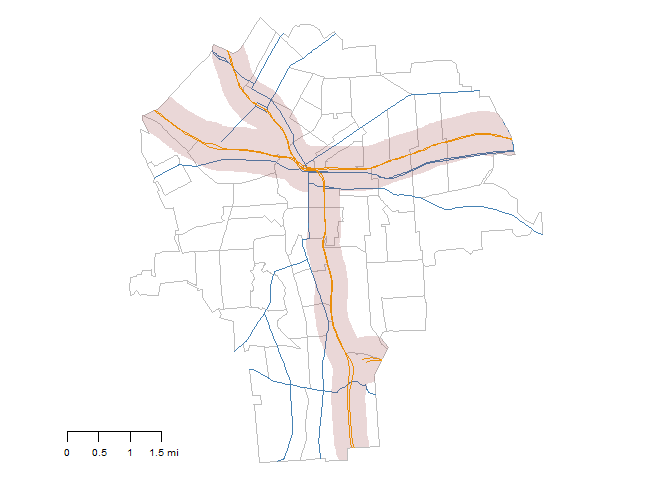
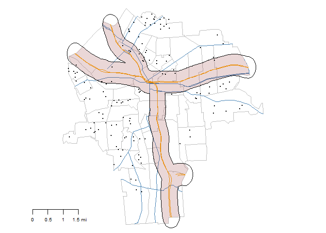

Independent\_study\_lab6
================
Mengran

<!-- Part 1: (1) Download the Tiger shapefiles for Onondaga County census tracts and primary and secondary roads (see attached). Plot both together, highlighting interstates. 
(2) Clip the roads shapefile so that it is the same size as the census tracts shapefile. 
(3) Extract the interstates as a separate layer (subset function). 
(4) Create a buffer of approximately a quarter mile (eyeball this) from the interstate, and identify all houses that fall within this zone. 
(5) Add a new categorical variable to the houses dataset that indicates whether it falls within the buffer zone or not. -->
<!-- Part 2: Using the Syracuse parcel file: (1) Create a buffer a quarter mile from industrial zones (LandUse). Create a plot to highlight your buffer zone. (2) Identify houses within the buffer zone and create a categorical variable in the dataset indicating proximity to industrial zones. (3) Create a buffer zone an eighth of a mile from schools. Create a plot go highlight these buffer zones. (4) Identify houses within the buffer zone and create a categorical variable in the dataset indicating proximity to schools. -->
``` r
#install.packages("rgeos")
#install.packages("raster")

library( maps )
library( maptools )
library( rgeos )
library( sp )
library( raster )
library(dplyr)

#download data and create working directory
setwd("C:/Users/mgao05/Desktop/PAI INdenpendent study/all-labs-ddmii-mgao05/lab06/shapefile")


#Download data for Onondaga county
#download.file("ftp://ftp2.census.gov/geo/tiger/TIGER2010/TRACT/2010/tl_2010_36067_tract10.zip", "onondaga_census_tracts.zip" )
#unzip( "onondaga_census_tracts.zip" )
#file.remove( "onondaga_census_tracts.zip" ) 
#remember to comment downloading command 


#download data for road

#download.file("ftp://ftp2.census.gov/geo/tiger/TIGER2015/PRISECROADS/tl_2015_36_prisecroads.zip", "roads_census.zip" )
#unzip( "roads_census.zip" )
#file.remove( "roads_census.zip" )
#remember to comment downloading command 
```

load data

``` r
#load onondaga census data
onondaga_shapefile <- readShapePoly( fn="tl_2010_36067_tract10", proj4string=CRS("+proj=longlat +datum=WGS84") )
#subset syracuse data
syr.shape <- onondaga_shapefile[as.numeric(as.character(onondaga_shapefile$NAME10)) < 62, ]

#load road census data
roads_census <- readShapeLines( fn="tl_2015_36_prisecroads", proj4string=CRS("+proj=longlat +datum=WGS84") )
#subset interstates data
interstate_road <- roads_census[ roads_census$RTTYP == "I" , ]
noninterstate_road <- roads_census[ roads_census$RTTYP != "I" , ]

#subset roads within syracuse area
inter_clipped <- gIntersection(syr.shape, interstate_road, byid = TRUE, drop_lower_td = TRUE)
noninter_clipped <- gIntersection(syr.shape, noninterstate_road, byid = TRUE, drop_lower_td = TRUE) 
```

``` r
#create plots
par( mar=c(0,0,0,0) )
plot(syr.shape, border="gray")
plot(noninter_clipped, col = "steelblue", lwd=1.5, add=T)
plot(inter_clipped, col = "orange", lwd=1, add=T)


buff1 <- gBuffer( inter_clipped, width=.005, byid=T )
buff1 <- gUnaryUnion( buff1, id = NULL )
buff1_clipped <- gIntersection(syr.shape, buff1)

#Add Scale
map.scale( metric=F, ratio=F, relwidth = 0.1, cex=.6 )
plot(buff1_clipped, col=rgb(150,50,50,50,maxColorValue=255),add=T, border=F)
```

 create buffer

``` r
#load housing data

houses <- read.csv("https://raw.githubusercontent.com/lecy/hedonic-prices/master/Data/Housing%20Price%20In-Class%20Exercise%20(Responses).csv", stringsAsFactors = F)

lat.lon <- read.csv("lat.lon.csv", stringsAsFactors = F)
lat.lon <- lat.lon[ c("lon","lat")]

par( mar=c(0,0,0,0) )
plot(syr.shape, border="gray")
plot(noninter_clipped, col = "steelblue", lwd=1.5, add=T)
plot(inter_clipped, col = "orange", lwd=1, add=T)
buff1 <- gBuffer( inter_clipped, width=.005, byid=T )
buff1 <- gUnaryUnion( buff1, id = NULL )
buff1_clipped <- gIntersection(syr.shape, buff1)

#Add Scale
map.scale( metric=F, ratio=F, relwidth = 0.1, cex=.6 )
plot(buff1_clipped, col=rgb(150,50,50,50,maxColorValue=255),add=T, border=F)

  
house <- points(lat.lon$lon, lat.lon$lat, pch = 19, cex=.3)

plot(buff1, add=T)
```



``` r
#inter_clipped <- gIntersection(syr.shape, house, byid = TRUE, drop_lower_td = TRUE)
#noninter_clipped <- gIntersection(syr.shape, house, byid = TRUE, drop_lower_td = TRUE)
```
